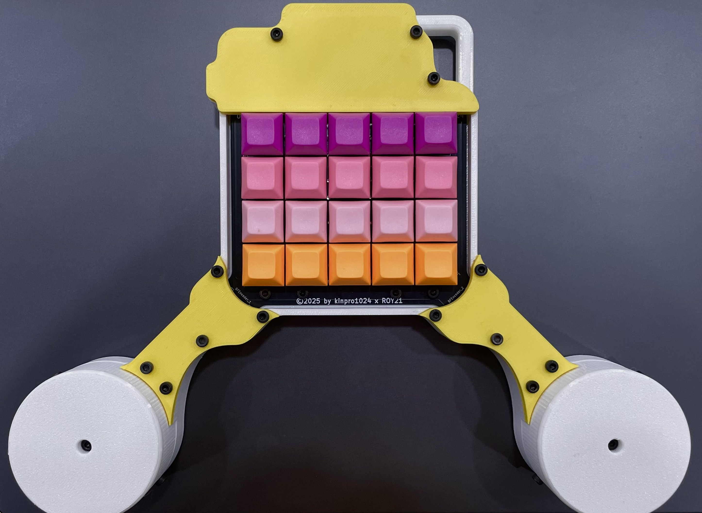
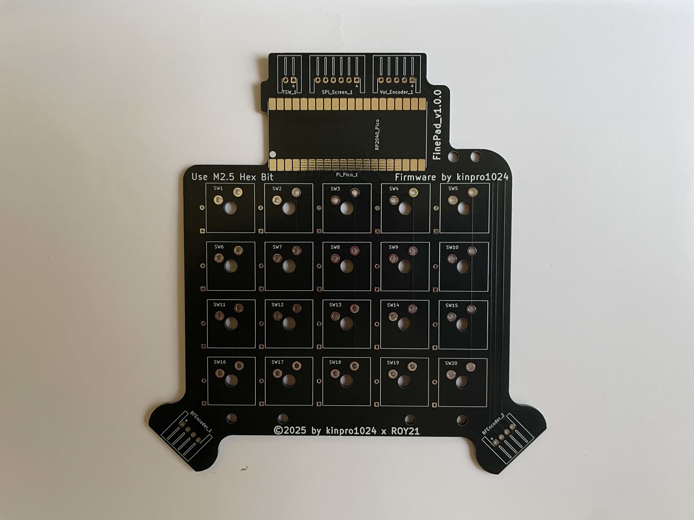
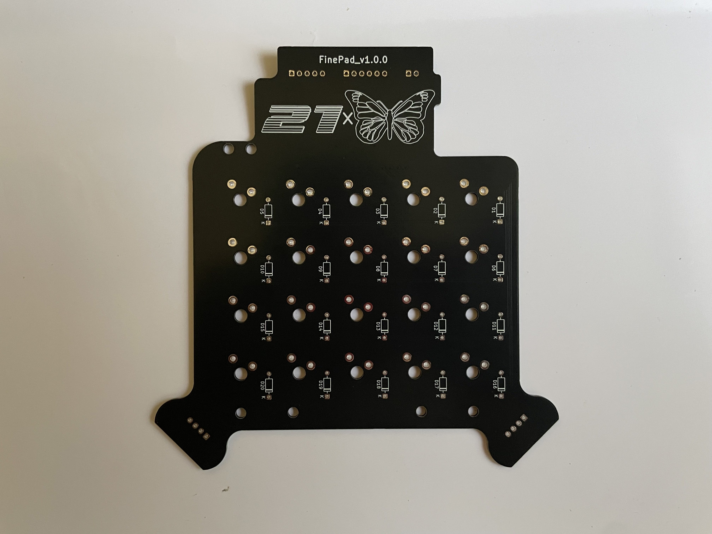
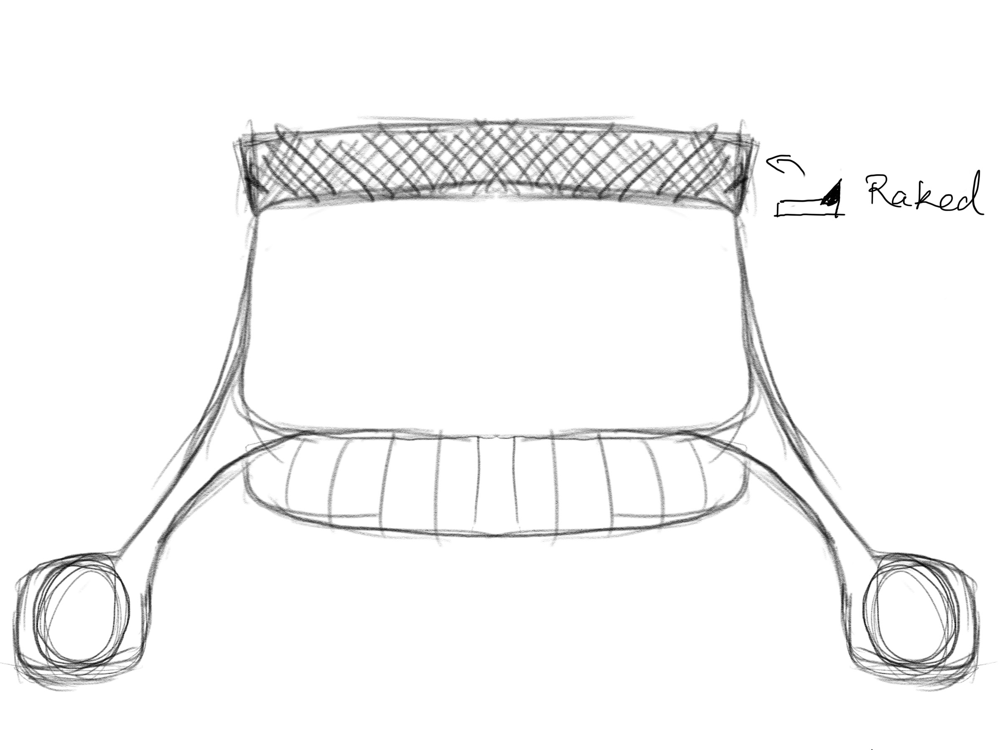

# FinePad (kinpro1024 × ROY21)
### Precision Dual-Axis Macropad
FinePad is a macropad designed with fine pointer control for precision-requiring situations like colour curve modificatioins or timeline scrubbing.
FinePad comes with two independently scrolling Rotary Encoder Knobs for precision X and Y axis control of the Pointer.

This is the version of finepad with no screen. A version with mode toggle and screen is coming soon.

Finepad is built on a Custom PCB.

*This is a concept sketch of the FinePad.*

## Why Fine pointer control
A macropad with dual fine scrolling knobs for X and Y control gives users a level of precision that mice and trackpads struggle to achieve. When working with:
- Colour Curves
- Exposure
- Fine Parameter Sliders
As even small unintended movements with a mouse can lead to inconsistent results in these situations.

**Dedicated knobs allow for smooth, incremental control, making subtle adjustments far more intuitive and repeatable.** Separating X and Y into physical controls also reduces cognitive load, since each axis becomes a deliberate action rather than a coordinated hand movement. This is especially valuable in workflows like:
- Photo Editing
- Colour Grading
- Audio Tuning
Where precision directly impacts output quality. Overall, it transforms delicate adjustments from a frustrating task into a controlled, tactile experience.

## Hardware Overview
FinePad uses a custom PCB as it's base:
- Raspberry Pi Pico handles Firmware.
- Two AS5600 Hall Effect Absolute Encoders.

# FinePad (screenless) was completed on 10/Apr/2026. It is a collaboration between kinpro1024 and ROY21.
# FinePad will get a toggle switch, screen and volume knob in an upcoming update. The full firmware will also come soon.